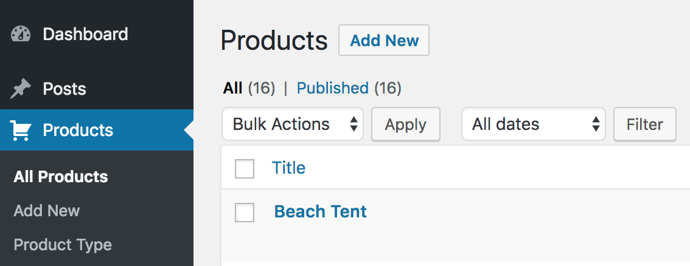
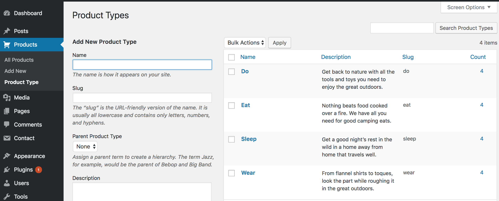

# Project 4: Inhabitent Camping Supply Co. Website

This is a website of a camping supply company, created using WordPress as a CMS.

I created a custom WordPress theme called Inhabitent Theme for the website. The website contains blog posts, product descriptions, a custom static homepage, an About page, and an Contact page.

## Key points of WordPress:
* ### Created a custom page template for the About page and the Home page.

* ### Created a custom post type for Products inside of a functionality plugin.

* ### Created a custom taxonomy for Product Type inside of a functionality plugin.

* ### Added custom fields for additional metadata.

* ### Included a custom widget plugin for business hours and added this widgetized area in the sidebar of the website.

## Key point of JavaScript:
* Added a toggle-able search form to the site header where the search input is automatically focused when the form is toggled open.